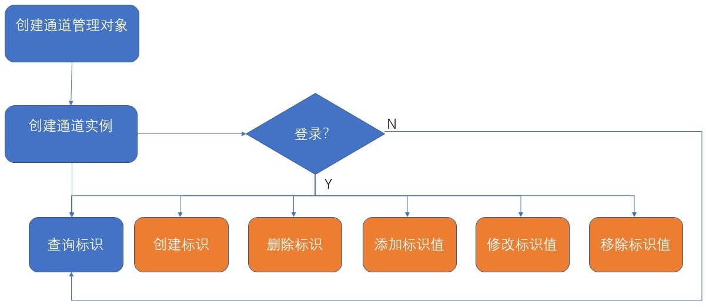

## ID-SDK开发指南

#### 基本概念介绍：  
ID-SDK:标识系统开发包。  
管理操作：创建标识、删除标识、添加标识值、修改标识值、移除标识值。  
非管理操作：主要是查询操作。  
通道：ID-SDK与标识系统之间的连接。  

#### ID-SDK与标识版本对应关系说明
> |ID-SDK版本|标识系统版本                              |
> | :-------- | :--------|
>|2.0.0  |企业版1.3.0 |
>|2.0.1  |企业版1.3.1-2 |

#### 快速使用
1. jar包获取：下载开源项目ID-SDK，导出jar包，并从该项目中获取依赖jar包，log4j-1.2.17.jar、gson-2.3.1.jar、commons-codec-1.12.jar、commons-logging-1.2.jar、bcprov-jdk15on-1.62.jar、hutool-all-4.6.3.jar。
2. 环境要求：jdk1.8或以上。
3. 开发示例：
建立java项目，导入ID-SDK的jar包以及其依赖的jar包，根据我们提供的联系方式（参见[README.md](./README.md)）获取到标识服务的环境信息以及登录信息以后，通过以下三个步骤可以快速进行开发：  
1).  创建通道管理实例IChannelManageService  
2).  创建与标识服务系统连接的通道实例IIDManageServiceChannel，此处需要提供标识服务的IP地址和端口号，采用“TCP”传输协议  
3). 通道实例IIDManageServiceChannel创建成功，即可以进行查询操作，若要进行标识管理操作，需要首先执行登录操作，登录成功以后可以进行各项管理操作  
如图：  


Demo如下：
```java
package test1;

import cn.ac.caict.iiiiot.id.client.core.BaseResponse;
import cn.ac.caict.iiiiot.id.client.core.ErrorResponse;
import cn.ac.caict.iiiiot.id.client.core.IdentifierException;
import cn.ac.caict.iiiiot.id.client.data.IdentifierValue;
import cn.ac.caict.iiiiot.id.client.data.MsgSettings;
import cn.ac.caict.iiiiot.id.client.service.IChannelManageService;
import cn.ac.caict.iiiiot.id.client.service.IIDManageServiceChannel;
import cn.ac.caict.iiiiot.id.client.service.impl.ChannelManageServiceImpl;

public class TestManageConnection {
	public static final int CHANNEL_CLOSED = 0;
	public static final int CHANNEL_LOGIN = 1;
	public static final int CHANNEL_LOGOUT = 2;
	public static void main(String[] args) {
		//创建通道管理实例
		IChannelManageService idfService = new ChannelManageServiceImpl();
		try {
			//根据标识服务系统提供的ip和端口，创建与标识服务系统的连接通道对象
			IIDManageServiceChannel channel = idfService.generateChannel("192.168.150.13", 1304, "TCP");
			//若要对标识进行管理操作，则需要首先登录
			if (channel != null && idfService.getIDManageServiceChannelState(channel) == CHANNEL_LOGOUT) {
				//登录
				BaseResponse loginResp = testLogin(channel);
				if(loginResp != null && loginResp.responseCode == 1){
					System.out.println("登录成功!");
					//创建标识
					BaseResponse createResp = testCreate(channel);
					if(createResp != null && createResp.responseCode == 1){
						System.out.println("标识创建成功!");
					} else if(createResp != null && createResp instanceof ErrorResponse){
						System.out.println(((ErrorResponse)createResp).toString());
					}
					//添加标识值
					//BaseResponse addResp = testAdd(channel);
					//修改标识值
					//BaseResponse editResp = testEdit(channel);
					//移除标识值
					//BaseResponse rmResp = testRemove(channel);
					//删除标识
					//BaseResponse delResp = testDelete(channel);
					//if(delResp != null && delResp.responseCode == 1)
					//	System.out.println("删除成功!");
				}
			}
			//通道未登录也可以执行查询操作
			BaseResponse resp = testLookup(channel);
			System.out.println(resp);
			
		} catch (IdentifierException e) {
			e.printStackTrace();
		}
	}
	private static BaseResponse testLogin(IIDManageServiceChannel channel) throws IdentifierException{
		return channel.login("88.1000.1/ADMIN", 301, "C:\\keys\\rsa_pri.pem", null,1,new MsgSettings());
	}
	private static BaseResponse testDelete(IIDManageServiceChannel channel) throws IdentifierException{
		return channel.deleteIdentifier("88.1000.2/mm", new MsgSettings());
	}
	
	private static BaseResponse testCreate(IIDManageServiceChannel channel) throws IdentifierException{
		IdentifierValue[] values = new IdentifierValue[5];
		values[0] = new IdentifierValue(1, "URL", "www.aaa.com");
		values[1] = new IdentifierValue(2, "email", "www.163.com");
		values[2] = new IdentifierValue(3, "url", "www.ccc.com");
		values[3] = new IdentifierValue(4, "email", "www.ddd.com");
		values[4] = new IdentifierValue(5, "email", "www.fff.com");
		return channel.createIdentifier("88.1000.2/mm", values, new MsgSettings());
	}
	
	private static BaseResponse testAdd(IIDManageServiceChannel channel) throws IdentifierException{
		IdentifierValue[] values = new IdentifierValue[2];
		values[0] = new IdentifierValue(6, "URL", "www.666.com");
		values[1] = new IdentifierValue(7, "email", "www.777.com");
		return channel.addIdentifierValues("88.1000.2/mm", values, new MsgSettings());
	}
	
	private static BaseResponse testEdit(IIDManageServiceChannel channel) throws IdentifierException{
		IdentifierValue[] values = new IdentifierValue[2];
		values[0] = new IdentifierValue(6, "email", "www.666e.com");
		values[1] = new IdentifierValue(7, "url", "www.777e.com");
		return  channel.modifyIdentifierValues("88.1000.2/mm", values, new MsgSettings());
	}
	
	private static BaseResponse testRemove(IIDManageServiceChannel channel) throws IdentifierException{
		IdentifierValue[] values = new IdentifierValue[2];
		values[0] = new IdentifierValue(6, "email", "www.666e.com");
		values[1] = new IdentifierValue(7, "url", "www.777e.com");
		int[] arr = {6,7};
		return  channel.removeIdentifierValues("88.1000.2/mm", arr, null);
	}
	
	private static BaseResponse testLookup(IIDManageServiceChannel channel) throws IdentifierException{
		String identifier = "88.1000.2/mm";
		int[] arr = null;
		String[] types = null;
		return channel.lookupIdentifier(identifier, arr, types, null);
	}

}
```
