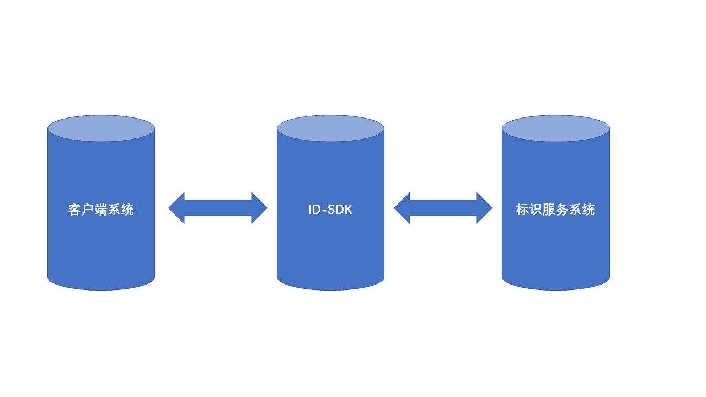

简体中文

#                                  IDIS-SDK

## 简介

欢迎使用 IDIS-SDK 。智能分布式标识系统即IDIS系统，是由工业互联网与物联网研究所（简称工物所）研发、用于对标识的管理和解析的系统。为方便用户使用该系统，工物所提供了IDIS-SDK以方便IDIS用户定制开发自有系统、快速接入工业互联网标识节点，如下图。这里向您介绍如何获取IDIS-SDK并快速使用。如果您在使用IDIS-SDK的过程中遇到任何问题，欢迎在当前GitHub[提交 Issues](https://github.com/4iot-dev/IDIS-SDK/issues/new)。

## 环境要求

1. 若您希望通过连接IDIS服务使用、了解IDIS-SDK开源项目，请与我们联系，我们将提供详细的环境资料，以便于您进行快速开发或调试。联系邮箱：fengyuan@caict.ac.cn

2. IDIS-SDK运行依赖gson-2.3.1.jar、commons-codec-1.12.jar、commons-logging-1.2.jar、log4j-1.2.17.jar。  
   添加依赖包步骤如下：
    在Eclipse项目中导入JAR包将IDIS-SDK-2.0.0.jar以及其依赖的gson-2.3.1.jar，commons-codec-1.12.jar，commons-logging-1.2.jar，log4j-1.2.17.jar拷贝到您的项目中。
    在Eclipse中选择您的工程，右击选择 Properties > Java Build Path > Add JARs。

3. IDIS-SDK需要JDK1.8以上的版本。
##  IDIS-SDK使用
通过IDIS-SDK连接IDIS系统进行标识操作，主要分3个步骤：

1. 创建IDIS-SDK的连接通道管理对象IChannelManageService。

2. 使用连接通道管理对象创建与IDIS的连接通道对象IIDManageServiceChannel。

3. 通过IIDManageServiceChannel对象可以进行标识查询或者管理操作。

  详见[IDIS-SDK开发指南](./IDIS-SDK开发指南.md)

## 文档

- [Change](./Change.md)
- [apidoc](./apidoc.md)
- [LICENSE](./LICENSE)
- [IDIS-SDK开发指南](./IDIS-SDK开发指南.md)

## 问题反馈

[提交 Issue](https://github.com/4iot-dev/IDIS-SDK/issues/new)。
邮件反馈：fengyuan@caict.ac.cn
我们将尽快给予回复。

## 发行说明

各版本更新将记录在[Change](./Change.md)中。

## 许可证

[Apache-2.0](http://www.apache.org/licenses/LICENSE-2.0)

版权所有 2019 工业互联网与物联网研究所

