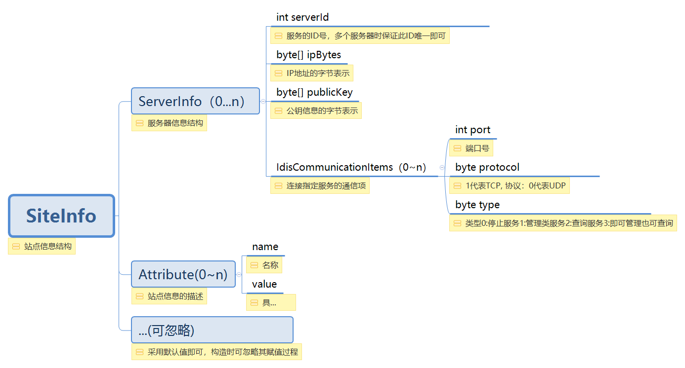
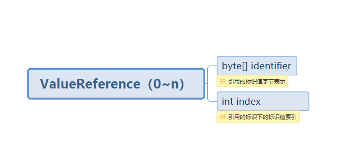
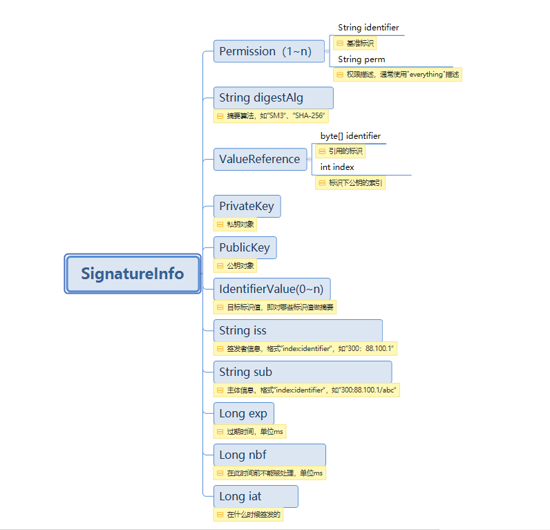
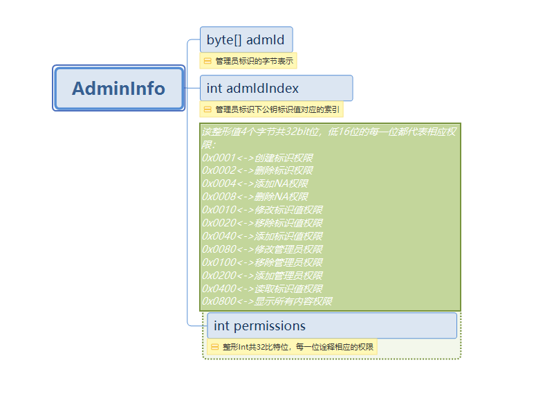

## apidoc

一\. 通道管理IChannelManageService

---

**1\. generateChannel**
###### 接口功能
> 创建与标识服务服务的连接通道实例（线程安全），需要捕获异常(异常码描述参照附表2)
###### 输入参数
>|参数|必选|类型|说明|
>| :-------- | :--------| :--------| :--------|
>|ip    |true    |String|目标服务的IP地址                          |
>|port    |true    |int   |目标服务端口|
>|protocol |true |String |数据传输采用的协议，TCP/UDP|
###### 返回值
> |类型|说明                              |
> | :-------- | :--------|
>|IIDManageServiceChannel   |返回通道实例，若创建失败则返回异常信息(异常码描述参照附表2) |
###### 接口示例

``` java
//创建通道管理实例
IChannelManageService chnnlService = new ChannelManageServiceImpl();
//创建与标识系统连接的通道
try {
	IIDManageServiceChannel channel = chnnlService .generateChannel("192.168.150.13", 1304, "TCP");
	if (channel != null && chnnlService .getIDManageServiceChannelState(channel) == 2){
		System.out.println("连接通道创建成功!");
	} else {
		System.out.println("连接通道创建失败!");
	}
} catch (IdentifierException e) {
	e.printStackTrace();
}
```
**2\. generateChannelByConfig**
###### 接口功能
> 创建连接通道实例（线程安全），需要捕获异常(异常码描述参照附表2)。该方法通过配置文件中配置的信息来创建连接通道，config.json配置文件在工程的src/目录下，由工程创建者添加，格式如下：
> {
>	   "ip":"127.0.0.1",
>	   "port":"1999",
>	   "query":true,
>	   "admin":true,
>	   "protocol":"TCP"
> }
###### 输入参数
无。

###### 返回值
> |类型|说明                              |
> | :-------- | :--------|
>|IIDManageServiceChannel   |返回已创建的连接通道实例，若创建失败则返回异常信息，需要捕获异常并处理(异常码描述参照附表2)  |
###### 接口示例

``` java
//创建通道管理实例
IChannelManageService chnnlService = new ChannelManageServiceImpl();
//创建与标识系统连接的通道
try {
	IIDManageServiceChannel channel = chnnlService .generateChannelByConfig();
	if (channel != null){
		System.out.println("连接通道创建成功!");
	} else {
		System.out.println("连接通道创建失败!");
	}
} catch (IdentifierException e) {
	e.printStackTrace();
}
```
**3\. closeChannel**
###### 接口功能
> 关闭连接通道，需要捕获异常(异常码描述参照附表2)
###### 输入参数
> |参数|必选|类型|说明|
> | :-------- | :--------| :--------| :--------|                           
>|channel   |true    |IIDManageServiceChannel|目标通道对象                          |
###### 返回值
无
###### 接口示例

``` java
//创建通道管理实例
IChannelManageService chnnlService = new ChannelManageServiceImpl();
try {
	IIDManageServiceChannel channel = chnnlService .generateChannel("192.168.150.13", 1304, "TCP");
	if (channel != null) {
		//关闭连接通道
		chnnlService .closeChannel(channel);
	} else {
		System.out.println("连接通道创建失败!");
	}
} catch (IdentifierException e) {
	e.printStackTrace();
}
```
**4\. getIDManageServiceChannelState**
###### 接口功能
> 获取连接通道状态
###### 输入参数
> |参数|必选|类型|说明|
> | :-------- | :--------| :--------| :--------|     
>|channel   |true    |IIDManageServiceChannel|目标通道对象                          |
###### 返回值
> |类型         |说明                              |
> | :-------- | :--------|   
>|int   |0代表关闭状态  1代表登录状态  2代表已连接但未登录状态 |
###### 接口示例
``` java
//创建通道管理实例
IChannelManageService chnnlService = new ChannelManageServiceImpl();
try {
	IIDManageServiceChannel channel = chnnlService .generateChannel("192.168.150.13", 1304, "TCP");
	if (channel != null) {
		//获取连接通道状态
int state = chnnlService .getIDManageServiceChannelState(channel);
		if(state == 0){
			System.out.println("当前连接通道已关闭");
		} else if (state == 1){
			System.out.println("当前连接通道已登录");
		} else if(state == 2){
			System.out.println("当前连接通道未登录");
		}
	} 
} catch (IdentifierException e) {
	e.printStackTrace();
}
```
**5\. getIDManageServiceChannelCount**
###### 接口功能
> 获取当前连接通道个数
###### 输入参数
无
###### 返回值
> |类型            |说明                              |
> | :-------- | :--------|  
>|int   |当前连接通道个数  |
###### 接口示例
``` java
//创建通道管理实例
IChannelManageService chnnlService = new ChannelManageServiceImpl();
try {
	IIDManageServiceChannel channel = chnnlService .generateChannel("192.168.150.13", 1304, "TCP");
	if( channel != null) {
		int count = chnnlService .getIDManageServiceChannelCount();
		System.out.println("当前的连接数为：" + count);
	}
} catch (IdentifierException e) {
	e.printStackTrace();
}
```
**6\. getChannelUserIdentifier**
###### 接口功能
> 获取目标通道登录用户标识名称，若未登录则返回null
###### 输入参数
> |参数|必选|类型|说明|
> | :-------- | :--------| :--------| :--------|  
> |channel   |true    |IIDManageServiceChannel |目标通道对象                          |
###### 返回值
> |类型|说明                              |
> | :-------- | :--------|
> |String   |登录用户标识名称  |
###### 接口示例
``` java
//创建通道管理实例
IChannelManageService chnnlService = new ChannelManageServiceImpl();
try {
	//根据标识服务提供的ip和端口，创建与标识服务的连接通道对象
	IIDManageServiceChannel channel = chnnlService.generateChannel("192.168.150.13", 1304, "TCP");
	if (channel != null) {
		BaseResponse loginResp = channel.login("88.1000.1/ADMIN", 301, "c:\\keys\\rsa_pri.pem", null,1,new MsgSettings());
		if(loginResp != null && loginResp.responseCode == 1){
			System.out.println("登录成功!");
			String userId = chnnlService.getChannelUserIdentifier(channel);
			System.out.println(userId);								
		}
	}
} catch (IdentifierException e) {
	e.printStackTrace();
}
```
二\. 标识管理IIDManageServiceChannel

---
标识管理操作是基于请求响应模型实现数据通信的。
在进行数据通信过程中，消息设置是通过MsgSetting结构来实现的，说明如下：
>|字段|类型|默认值|描述|
>| :-------- | :--------| :--------| :--------|
>|truestyQuery |boolean |false |查询时是否进行可信解析                            |
>|certify |boolean |false |是否做消息凭据验证                            |

在进行数据通信过程中，标识值数据是通过IdentifierValue结构来设置的，说明如下：
>|字段|类型|默认值|描述|
>| :-------- | :--------| :--------| :--------|
>|index |int |-1 |标识值的索引                            |
>|type |byte[]  |new byte[0] |标识值类型                            |
>|data |byte[] |new byte[0] |标识值数据                            |
>|bAdminRead |boolean |true |管理员可读                            |
>|bAdminWrite |boolean |true |管理员可写                            |
>|bPublicRead |boolean |true |公共可读                            |
>|bPublicWrite  |boolean |false |公共可写                            |
>|ttl |int |86400 |存活时间，单位秒                           |
>|ttlType |byte |0 |默认采用相对时间模式                            |
>|timestamp |int |当前时间 |时间戳 ，从1970年起始计算至当前时间的秒数                         |
>|references |ValueReference[]  |null |标识值引用的标识值数组，  ValueReference结构指的是包含byte[]类型的标识和标识值的某索引，该索引即是引用的标识值的索引。                        |

**1\. login**
###### 接口功能
> 与标识服务的连接通道建立后，若标识服务开启分布式身份认证，在进行标识管理操作前必须首先登录。该操作需要捕获异常(异常码描述参照附表2)。
###### 输入参数
> |参数|必选|类型|说明|
>| :-------- | :--------| :--------| :--------|     
>|identifier   |true    |String|管理员标识                          |
>|index |true    |int |公钥对应标识值的索引                          |
>|privakeyFilePath |true    |String |私钥文件路径，支持pem文件格式私钥                          |
>|password |false |String |如果私钥有密码，将密码赋值给password,如果私钥没有密码则password为null                         |
>|rdType |true    |int |生成摘要hash算法，MD5算法：rdType=1，SH1算法：rdType=2，SH256算法：rdType=3                         |
>|settings |false    |MsgSettings |消息设置                        |
###### 返回值
> |类型|说明                              |
>| :-------- | :--------|
>|BaseResponse   |返回码为1登录成功，返回码不为1则登录失败（其他返回码参照附表1）  |
###### 接口示例
``` java
//创建通道管理实例
IChannelManageService chnnlService = new ChannelManageServiceImpl();
try {
	//根据标识服务提供的ip和端口，创建与标识服务的连接通道对象
	IIDManageServiceChannel channel = chnnlService.generateChannel("192.168.150.13", 1304, "TCP");
	if (channel != null) {
		BaseResponse loginResp = channel.login("88.1000.1/ADMIN", 301, "c:\\keys\\rsa_pri.pem", null,1);
		if(loginResp != null && loginResp.responseCode == 1){
			System.out.println("登录成功!");							
		} else if(loginResp != null && loginResp instanceof ErrorResponse){
			System.out.println((ErrorResponse) loginResp).toString();
		}
	}
} catch (IdentifierException e) {
	e.printStackTrace();
}
```
**2\. lookupIdentifier**
###### 接口功能
> 该查询操作可以通道创建后不登录的情况下执行，在通道登录情况下也可执行。当然如果连接通道断开是无法查询的。该接口的功能是查询指定标识下的标识值信息，可以查询指定标识下的全部标识值，也可以进行条件查询，即按索引、类型进行查询。需要捕获异常(异常码描述参照附表2)。
> 在执行查询标识时，将MsgSetting的truestyQuery字段设置为true时，查询结果是经过国家标识解析体系认证的，是具有权威可信性的。
###### 输入参数
> |参数|必选|类型|说明|
>| :-------- | :--------| :--------| :--------|     
>|identifier   |true    |String|标识名称                         |
>|indexes   |false    |int[]|待查询标识值的索引数组                         |
>|types   |false    |String[]|待查询标识值的数据类型数组                         |
>|settings |false    |MsgSettings |消息设置                        |
###### 返回值
> |类型|说明                              |
>| :-------- | :--------| 
>|BaseResponse   |返回码为1查询成功，返回码不为1查询结果异常（其他返回码参照附表1）。当消息设置中将truestyQuery字段置为true即进行可信解析时，返回值BaseResponse的trustedResult字段代表可信解析结果，有三种取值：0代表返回的结果不确定是否可信，1代表返回的结果可信，2代表返回的结果不可信  |
###### 接口示例
``` java
//创建通道管理实例
IChannelManageService chnnlService = new ChannelManageServiceImpl();
try {
	//根据标识系统提供的ip和端口，创建与标识系统的连接通道对象
	IIDManageServiceChannel channel = chnnlService.generateChannel("192.168.150.13", 1304, "TCP");
	//若要对标识进行管理操作，则需要首先登录
	if (channel != null) {
		//通道未登录也可以执行查询操作
		String identifier = "88.1000.2/mm";
		int[] arr = null;
		String[] types = null;
		BaseResponse resp = channel.lookupIdentifier(identifier, arr, types, null);
				System.out.println(resp);
	}
} catch (IdentifierException e) {
	e.printStackTrace();
}
```
**3\. createIdentifier**
###### 接口功能
> 创建标识，可以仅创建标识不带有标识值，也可以在创建带有标识值的标识。该接口需要捕获异常(异常码描述参照附表2)。
###### 输入参数
> |参数|必选|类型|说明|
>| :-------- | :--------| :--------| :--------|  
>|identifier   |true    |String|待创建标识名称                          |
>|values   |false    |IdentifierValue[] |创建标识可以添加标识值，若不添加标识值则该值为null                          |
>|settings   |false |MsgSettings |消息设置                          |
###### 返回值
> |类型|说明                              |
>| :-------- | :--------|
>|BaseResponse   |返回码为1创建标识成功，返回码不为1则创建标识失败（其他返回码参照附表1） |
###### 接口示例
``` java
//创建通道管理实例
IChannelManageService chnnlService = new ChannelManageServiceImpl();
try {
	//根据标识系统提供的ip和端口，创建与标识系统的连接通道对象
	IIDManageServiceChannel channel = chnnlService.generateChannel("192.168.150.13", 1304, "TCP");
	//若要对标识进行管理操作，则需要首先登录
	if (channel != null && chnnlService.getIDManageServiceChannelState(channel) == 2) {
		BaseResponse loginResp = channel.login("88.1000.1/ADMIN", 301, "c:\\keys\\rsa_pri.pem", null,1);
		if(loginResp != null && loginResp.responseCode == 1){
			//创建标识
			BaseResponse createResp = testCreate(channel);
			if(createResp != null && createResp.responseCode == 1){
				System.out.println("标识创建成功!");
			} else if(createResp != null && createResp instanceof ErrorResponse){
						System.out.println(((ErrorResponse)createResp).toString());
			}
		}
	}
} catch (IdentifierException e) {
	e.printStackTrace();
}
```
**4\. deleteIdentifier**
###### 接口功能
> 删除指定标识的全部数据，包括标识及其所有标识值。该接口需要捕获异常(异常码描述参照附表2)。
###### 输入参数
> |参数|必选|类型|说明|
>| :-------- | :--------| :--------| :--------|     
>|identifier   |true    |String|待删除标识名称                          |
###### 返回值
> |类型|说明                              |
>| :-------- | :--------| 
>|BaseResponse   |返回码为1删除成功，返回码不为1则删除失败 （其他返回码参照附表1） |
###### 接口示例
``` java
//创建通道管理实例
IChannelManageService chnnlService = new ChannelManageServiceImpl();
try {
	//根据标识系统提供的ip和端口，创建与标识系统的连接通道对象
	IIDManageServiceChannel channel = chnnlService.generateChannel("192.168.150.13", 1304, "TCP");
	//若要对标识进行管理操作，则需要首先登录
	if (channel != null && chnnlService.getIDManageServiceChannelState(channel) == CHANNEL_LOGOUT) {
		BaseResponse loginResp = channel.login("88.1000.1/ADMIN", 301, "c:\\keys\\rsa_pri.pem", null,1);
		if(loginResp != null && loginResp.responseCode == 1){
			System.out.println("登录成功!");
			//删除标识
			BaseResponse deleteResp = channel.deleteIdentifier("88.1000.2/mm", new MsgSettings());
			if(deleteResp != null && deleteResp.responseCode == 1){
				System.out.println("标识删除成功!");
			} else if(deleteResp != null && deleteResp instanceof ErrorResponse){						
			    System.out.println(((ErrorResponse)deleteResp).toString());
			}
		}
	}
} catch (IdentifierException e) {
	e.printStackTrace();
}
```
**5\. addIdentifierValues**
###### 接口功能
> 向目标标识添加若干标识值。该接口需要捕获异常(异常码描述参照附表2)。
###### 输入参数
> |参数|必选|类型|说明|
>| :-------- | :--------| :--------| :--------|     
>|identifier   |true    |String| 目标标识                         |
>|values   |true    |IdentifierValue[] | 待添加的标识值数组                         |
>|settings   |false |MsgSettings |消息设置                          |
###### 返回值
> |类型|说明                              |
>| :-------- | :--------|
>|BaseResponse   |返回码为1添加标识值成功，返回码不为1则添加标识值失败 (其他返回码参照附表1)|
###### 接口示例
``` java
//创建通道管理实例
IChannelManageService chnnlService = new ChannelManageServiceImpl();
try {
	//根据标识系统提供的ip和端口，创建与标识系统的连接通道对象
	IIDManageServiceChannel channel = chnnlService.generateChannel("192.168.150.13", 1304, "TCP");
	//若要对标识进行管理操作，则需要首先登录
	if (channel != null && chnnlService.getIDManageServiceChannelState(channel) == CHANNEL_LOGOUT) {
		BaseResponse loginResp = channel.login("88.1000.1/ADMIN", 301, "c:\\keys\\rsa_pri.pem", null,1);
		if(loginResp != null && loginResp.responseCode == 1){
			IdentifierValue[] values = new IdentifierValue[2];
			values[0] = new IdentifierValue(6, "URL", "www.666.com");
			values[1] = new IdentifierValue(7, "email", "www.777.com");
			BaseResponse addResp =  channel.addIdentifierValues("88.1000.2/mm", values, new MsgSettings());
			if(addResp != null && addResp.responseCode == 1){
				System.out.println("标识值添加成功!");
			} else if(addResp != null && addResp instanceof ErrorResponse){						
			    System.out.println(((ErrorResponse)addResp).toString());
			}
		}
	}
} catch (IdentifierException e) {
	e.printStackTrace();
}
```
***5.1*** 兼容的标识类型
 |类型名称|数据结构|描述|
| :-------- | :--------|    
|HS_SITE   |SiteInfo (图-Siteinfo)   |站点信息    |
|HS_SITE.PREFIX   |SiteInfo(图-Siteinfo)    |前缀站点信息|
|HS_VLIST   |ValueReference(图-VList)    |前缀站点信息|
|HS_CERT   |SignatureInfo(图-SignatureInfo)   |证书 |
|HS_SIGNATURE   |  SignatureInfo(图-SignatureInfo)   |签名 |
|HS_PUBKEY   |    String(公钥文件路径)         |公钥 |
|HS_ADMIN  |    AdminInfo(图-AdminInfo)     |管理员|
|HS_SERV  |     String (标识)     |服务引用|
***5.2*** 兼容标识类型的标识值构建示例
	 为了方便用户创建各类型标识，SDK提供了IdentifierValueUtil工具，对于一些类型简单的标识值，可以直接将字符串数据写入IdentifierValue的结构当中，也可以调用IdentifierValueUtil工具的makeIdentifierValueOfGeneralType方法；对于复杂类型标识值的创建，下文将介绍数据结构及如何利用IdentifierValueUtil工具去创建标识值的示例。
1.  如何创建一个HS_SITE/HS_SITE.PREFIX类型的标识值？
HS_SITE 和 HS_SITE.PREFIX是预定义的数据类型。它们的数据结构相同，通过（ip地址:端口号）来定义服务站点。
每个标识解析服务可有多个服务站点，每个服务站点可以由多个服务器计算机组成。针对任何标识解析服务的服务请求可以分布到不同的服务站点，并在任何服务站点内进入不同的服务器计算机。这样的体系结构确保每个标识解析服务都有能力管理大量的标识和标识请求。这种结构可以避免单点故障。
HS_SITE 和 HS_SITE.PREFIX提供的站点信息可以用来定位负责的标识解析服务器。同时客户端还可以使用服务信息（HS_SITE中的pubkey）对服务器的任何服务响应进行身份验证。

	1）SiteInfo
	
	图-Siteinfo
	2）java示例 
	``` java
	IdentifierValue iv = new IdentifierValue();
	int index = 20;
	// items[]
	IDCommunicationItems[] items = new IDCommunicationItems[2];
	items[0] = new IDCommunicationItems(IDCommunicationItems.ST_ADMIN_AND_QUERY,
			IDCommunicationItems.TS_IDF_TCP, 1304);
	items[1] = new IDCommunicationItems(IDCommunicationItems.ST_ADMIN_AND_QUERY,
			IDCommunicationItems.TS_IDF_UDP, 1304);
	// server
	ServerInfo ser1 = new ServerInfo();
	ser1.communicationItems = items;
	ser1.ipBytes = Util.convertIPStr2Bytes("192.168.150.13");
	ser1.publicKey = Util.getBytesFromFile("C:/temp/serv/pubkey.pem");
	ser1.serverId = 1;
	// servers
	ServerInfo[] servArr = new ServerInfo[] { ser1 };
	// siteinfo
	SiteInfo si = new SiteInfo();
	si.servers = servArr;
	si.attributes = null;
	// 创建HS_SITE类型标识值
	IdentifierValueUtil.makeIdentifierValueOfSiteInfo(iv, si, index);
	// 创建HS_SITE.PREFIX类型标识值
	//IdentifierValueUtil.makeIdentifierValueOfSiteInfoPrefix(iv, si, index);
	```
	
2.  如何创建HS_VLIST类型的标识值？
 标识值引用列表
	1）ValueReference数组
	
	     图-VList
	2）创建HS_VLIST类型标识值示例
	``` java
	IdentifierValue iv = new IdentifierValue();
	int index = 30;
	ValueReference[] vr = new ValueReference[2];
	vr[0] = new ValueReference("88.1000.2/mm", 1);
	vr[1] = new ValueReference("88.1000.2/cup", 2);
	IdentifierValueUtil.makeIdentifierValueOfVList(iv, vr, index);
	```
	
3. 如何创建HS_CERT类型的标识值？

	1）SignatureInfo结构
	
	     图-SignatureInfo
	说明：
	支持的RSA、SM2密钥对
	摘要算法支持SHA-256,SM3
	
	2）创建HS_CERT类型标识值示例

	```java
PublicKey pubKey = Util.getPublicKeyFromFile("c:/temp/keys/pubkey.pem");
PrivateKey prvKey = Util.getPrivateKeyFromFile("c:/temp/keys/privatekey.pem", null);
List<Permission> perms = new ArrayList<>();
perms.add(new Permission(null, "everything"));
IdentifierValue iv = new IdentifierValue();
int index = 401;
SignatureInfo signInfo = SignatureInfo.newCertificationInstance(prvKey, pubKey, perms, "100:88", "300:88.996", "2020-12-12 23:59:59","2019-11-25 00:00:00", "2019-11-24 15:44:00");
IdentifierValueUtil.makeIdentifierValueOfCertification(iv, index, signInfo);
	```
	
4.  如何创建HS_SIGNATURE类型的标识值？

	1）SignatureInfo结构
	参照3-1 SignatureInfo结构

	2）创建HS_SIGNATURE类型标识值示例
	
	```java
IdentifierValue iv = new IdentifierValue();
int index = 400;
PrivateKey prvKey = Util.getPrivateKeyFromFile(SIGNATURE_PRVKEY_PATH, null);
IdentifierValue[] values = new IdentifierValue[1];
BaseResponse response = channel.lookupIdentifier(OP_ID, null, null, null);
if (response instanceof ResolutionResponse) {
	      values = ((ResolutionResponse) response).getAllIDValues();
}
SignatureInfo signInfo = SignatureInfo.newSignatureInstance(prvKey, values, "300:88.996", "88.996.438","2020-12-12 23:59:59", "2019-11-25 00:00:00", "2019-11-24 15:44:00", "SM3");
IdentifierValueUtil.makeIdentifierValueOfSignature(iv, index, signInfo);
	```
5.  如何创建HS_PUBKEY类型的标识值？

	1) 公钥文件，支持DSA和RSA算法的公钥，创建标识值时提供公钥文件的路径

	2）创建HS_PUBKEY类型标识值示例
	```java
	IdentifierValue iv = new IdentifierValue();
	int index = 300;
	IdentifierValueUtil.makeIdentifierValueOfPublicKey(iv, "c:/temp/keys/pubkey.pem", index);
	```
6.  如何创建HS_ADMIN类型的标识值？
HS_ADMIN值用于标识解析服务在完成任何管理请求之前对标识管理员进行身份验证。
	1）AdminInfo结构
	
	     图-AdminInfo
	2）创建HS_ADMIN类型标识值示例
	```java
		IdentifierValue value = new IdentifierValue();
		AdminInfo admin = new AdminInfo();
		admin.admId = Util.encodeString("88.1000.2/cupA");
		admin.admIdIndex = 302;
		admin.initPermissions(true, true, true, true, true, true, true, true, true, true, true, true);
		IdentifierValueUtil.makeIdentifierValueOfAdminInfo(value, admin, 10);
	```
**6\. modifyIdentifierValues**
###### 接口功能
> 修改目标标识下的若干标识值。该接口需要捕获异常(异常码描述参照附表2)。
###### 输入参数
> |参数|必选|类型|说明|
>| :-------- | :--------| :--------| :--------|     
>|identifier   |true    |String| 目标标识                         |
>|values   |true    |IdentifierValue[] | 待编辑的标识值数组                         |
>|settings   |false |MsgSettings |消息设置                          |
###### 返回值
> |类型|说明                              |
>| :-------- | :--------| 
>|BaseResponse   |返回码为1修改标识值成功，返回码不为1则修改标识值失败(其他返回码参照附表1)  |
###### 接口示例
``` java
//创建通道管理实例
IChannelManageService chnnlService = new ChannelManageServiceImpl();
try {
	//根据标识系统提供的ip和端口，创建与标识系统的连接通道对象
	IIDManageServiceChannel channel = chnnlService.generateChannel("192.168.150.13", 1304, "TCP");
	if (channel != null && chnnlService.getIDManageServiceChannelState(channel) == CHANNEL_LOGOUT) {
		BaseResponse loginResp = channel.login("88.1000.1/ADMIN", 301, "c:\\keys\\rsa_pri.pem", null,1);
		if(loginResp != null && loginResp.responseCode == 1){
			IdentifierValue[] values = new IdentifierValue[2];
			values[0] = new IdentifierValue(6, "email", "www.666e.com");
			values[1] = new IdentifierValue(7, "url", "www.777e.com");
			BaseResponse modifyResp =  channel.modifyIdentifierValues("88.1000.2/mm", values, new MsgSettings());
			if(modifyResp != null && modifyResp.responseCode == 1){
				System.out.println("编辑标识值成功!");
			} else if(modifyResp != null && modifyResp instanceof ErrorResponse){					
				System.out.println(((ErrorResponse)modifyResp).toString());
			}
		}
	}
} catch (IdentifierException e) {
	e.printStackTrace();
}
```
**7\. removeIdentifierValues**
###### 接口功能
> 移除目标标识下指定索引对应的标识值
###### 输入参数
> |参数|必选|类型|说明|
>| :-------- | :--------| :--------| :--------|     
>|identifier   |true    |String|目标标识                          |
>|indexes |true    |int[] |待移除标识值索引                          |
>|settings   |false |MsgSettings |消息设置                          |
###### 返回值
> |类型|说明                              |
>| :-------- | :--------| 
>|BaseResponse   |返回码为1移除标识值成功，返回码不为1则移除标识值失败 (其他返回码参照附表1) |
###### 接口示例
``` java
//创建通道管理实例
IChannelManageService chnnlService = new ChannelManageServiceImpl();
try {
	//根据标识系统提供的ip和端口，创建与标识系统的连接通道对象
	IIDManageServiceChannel channel = chnnlService.generateChannel("192.168.150.13", 1304, "TCP");
	if (channel != null && chnnlService.getIDManageServiceChannelState(channel) == 2) {
		BaseResponse loginResp = channel.login("88.1000.1/ADMIN", 301, "c:\\keys\\rsa_pri.pem", null,1);
		if(loginResp != null && loginResp.responseCode == 1){
			int[] arr = {6,7};
			BaseResponse removeResp =  channel.removeIdentifierValues("88.1000.2/mm", arr, new MsgSettings());
			if(removeResp != null && removeResp.responseCode == 1){
						System.out.println("移除标识值成功!");
			} else if(removeResp != null && removeResp instanceof ErrorResponse){
						System.out.println(((ErrorResponse)removeResp).toString());
			}
		}
	}
} catch (IdentifierException e) {
	e.printStackTrace();
}
```
**8\. isLogin**
###### 接口功能
> 判断当前通道是否已登录
###### 输入参数
无
###### 返回值
> |类型|说明                              |
>| :-------- | :--------| 
>|boolean |若已登录则返回true,若未登录则返回false  |
###### 接口示例
``` java
//创建通道管理实例
IChannelManageService chnnlService = new ChannelManageServiceImpl();
try {
	//根据标识系统提供的ip和端口，创建与标识系统的连接通道对象
	IIDManageServiceChannel channel = chnnlService.generateChannel("192.168.150.13", 1304, "TCP");
	if(channel != null){
		boolean bLogin = channel.isLogin();
	}
} catch (IdentifierException e) {
	e.printStackTrace();
}
```
**9\. getServerSiteInfo**
###### 接口功能
> 获取服务器站点信息
###### 输入参数
> |参数|必选|类型|说明|
>| :-------- | :--------| :--------| :--------|     
>|settings   |false |MsgSettings |消息设置                          |
###### 返回值
> |类型|说明                              |
>| :-------- | :--------| 
>|BaseResponse   |返回码为1站点信息获取成功，返回码不为1则获取站点信息失败 (其他返回码参照附表1) |
###### 接口示例
``` java
//创建通道管理实例
IChannelManageService chnnlService = new ChannelManageServiceImpl();
try {
	//根据标识系统提供的ip和端口，创建与标识系统的连接通道对象
	IIDManageServiceChannel channel = chnnlService.generateChannel("192.168.150.13", 1304, "TCP");
	MsgSettings settings = new MsgSettings();
		BaseResponse response = channel.getServerSiteInfo(settings);
		if (response instanceof SiteResponse){
			SiteInfo si = ((SiteResponse) response).getSiteInfo();
			System.out.println("siteInfo:" + si);
		}	
} catch (IdentifierException e) {
	e.printStackTrace();
}
```
附表1

---
###### 响应码
> |响应码 |标识符|提示消息|
>| :-------- | :--------| :--------|
>|0   |RC_RESERVED    |RC_RESERVED                          |
>|1  |RC_SUCCESS    |SUCCESS                          |
>|2   |RC_ERROR    |ERROR                          |
>|3   |RC_SERVER_BUSY    |SERVER TOO BUSY                          |
>|4   |RC_PROTOCOL_ERROR    |PROTOCOL ERROR                          |
>|100   |RC_IDENTIFIER_NOT_FOUND    |IDENTIFIER NOT FOUND                          |
>|101   |RC_ IDENTIFIER _ALREADY_EXIST    |IDENTIFIER ALREADY EXISTS                          |
>|102   |RC_INVALID_ IDENTIFIER    |INVALID IDENTIFIER                          |
>|200   |RC_VALUE_NOT_FOUND    |VALUES NOT FOUND                          |
>|201   |RC_VALUE_ALREADY_EXIST    |VALUE ALREADY EXISTS                          |
>|202   |RC_VALUE_INVALID    |INVALID VALUE                          |
>|302   |RC_SERVICE_REFERRAL    |SERVICE REFERRAL                          |
>|303   |RC_PREFIX_REFERRAL    |PREFIX REFERRAL                          |
>|400   |RC_INVALID_ADMIN    |INVALID ADMIN                          |
>|401   |RC_INSUFFICIENT_PERMISSIONS |INSUFFICIENT PERMISSIONS                      |
>|402   |RC_AUTHENTICATION_NEEDED    |AUTHENTICATION NEEDED                          |
>|403   |RC_AUTHENTICATION_FAILED    |AUTHENTICATION FAILED                          |
>|404   |RC_INVALID_CREDENTIAL    |INVALID CREDENTIAL                          |
>|405   |RC_AUTHEN_TIMEOUT    |AUTHENTICATION TIMEOUT                          |
>|407   |RC_RELOGIN    |CLIENT REPEAT LOGIN                          |
>|408   |RC_LOGIN_FIRST    |PLEASE LOGIN FIRST                          |

附表2

---
###### 异常码
> |异常码     |标识符|提示消息|
>| :-------- | :--------| :--------| 
>|-1   |EXCEPTIONCODE_UNSUPPORTENCODING    |SDK_INNER_UNSUPPORTENCODING_EXCEPTION                          |
>|-2   |EXCEPTIONCODE_DISCONN_FAILED    |DISCONNECT_FAILED                          |
>|-4   |EXCEPTIONCODE_LONGCONNSOCKET_CREATE_FAILED    |LONGCONNSOCKET_CREATE_FAILED                          |
>|-5   |EXCEPTIONCODE_ILLEGAL_IP    |ILLEGAL_IP                          |
>|-6   |EXCEPTIONCODE_ILLEGAL_PORT    |ILLEGAL_PORT                          |
>|-7   |INVALID_PARM    |INVALID_PARAMETER                         |
>|-8   |IDENTIFIER_ENGINE_ERROR    |IDENTIFIER_ENGINE_ERROR                          |
>|-9   |JWT_PARSE_ERROR|JWT_PARSE_ERROR                      |
>|-10   |TIME_PARSE_ERROR    |TIME_PARSE_ERROR                  |
>|0   |EXCEPTIONCODE_INVALID_VALUE    |INVALID_VALUE                          |
>|1   |EXCEPTIONCODE_INTERNAL_ERROR    |INTERNAL_ERROR                          |
>|2   |EXCEPTIONCODE_FOUND_NO_SERVICE  |ISERVICE_NOT_FOUND                 |
>|3   |EXCEPTIONCODE_NO_ACCEPTABLE_IDCOMMUNICATIONITEMS    |NO_ACCEPTABLE_INTERFACES   |
>|4   |EXCEPTIONCODE_UNKNOWN_PROTOCOL    |UNKNOWN_PROTOCOL           |
>|5   |EXCEPTIONCODE_IDENTIFIER_ALREADY_EXISTS    |IDENTIFIER_ALREADY_EXISTS     |
>|6   |EXCEPTIONCODE_MESSAGE_FORMAT_ERROR|MESSAGE_FORMAT_ERROR |
>|7   |EXCEPTIONCODE_CANNOT_CONNECT_TO_ID_SYS_SERVER    |CANNOT_CONNECT_TO_SERVER                          |
>|8   |EXCEPTIONCODE_UNABLE_TO_AUTHENTICATE    |UNABLE_TO_AUTHENTICATE                          |
>|9   |EXCEPTIONCODE_IDENTIFIER_DOES_NOT_EXIST    |IDENTIFIER_DOES_NOT_EXIST|
>|10   |EXCEPTIONCODE_SECURITY_ALERT  |SECURITY_ALERT                          |
>|13   |EXCEPTIONCODE_MISSING_OR_INVALID_SIGNAtrue    |MISSING_OR_INVALID_SIGNAtrue                          |
>|14   |EXCEPTIONCODE_MISSING_CRYPTO_PROVIDER    |MISSING_CRYPTO_PROVIDER                          |
>|15   |EXCEPTIONCODE_ID_SYS_SERVER_ERROR    |SERVER_ERROR                          |
>|16   |EXCEPTIONCODE_UNKNOWN_ALGORITHM_ID  |UNKNOWN_ALGORITHM_ID                          |
>|17   |EXCEPTIONCODE_GOT_EXPIRED_MESSAGE    |GOT_EXPIRED_MESSAGE                          |
>|26   |EXCEPTIONCODE_ENCRYPTION_ERROR    |ENCRYPTION_ERROR                         |
>|29   |EXCEPTIONCODE_SERVICE_REFERRAL_ERROR    |SERVICE_REFERRAL_ERROR                          |

版权声明：工业互联网与物联网研究所